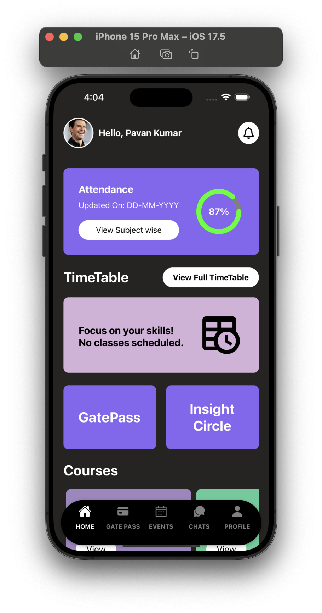
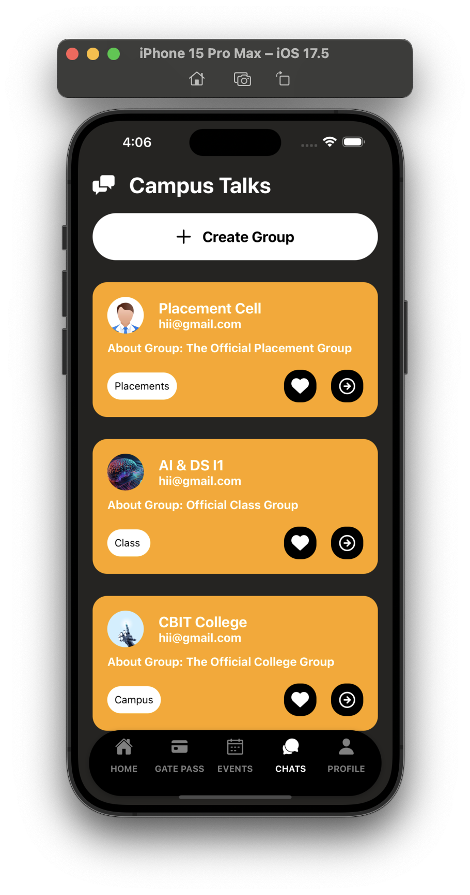
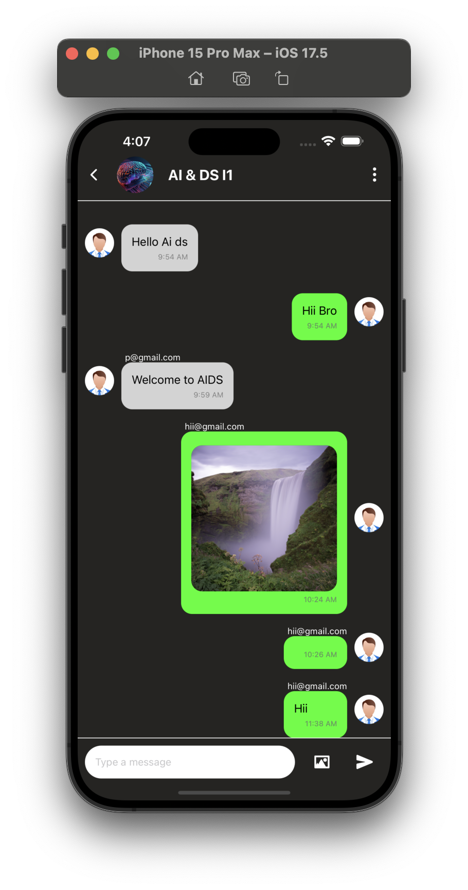
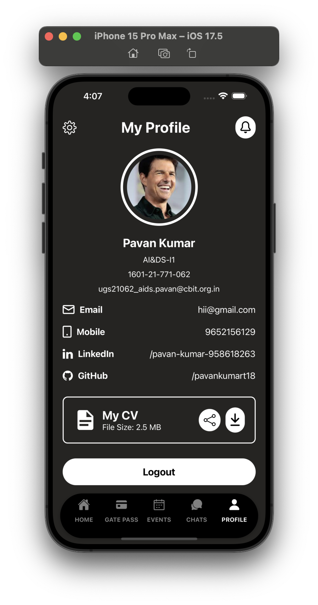

# CBIT Connect

CBIT-Connect is a mobile application developed for a college. It utilizes various technologies such as React Native, Vector Icons, Firebase for the database, and iOS Simulator and Android Emulator for cross-platform compatibility.

## Features

- Attendance system (under development)
- Open groups for all students
- Gatepass feature for immediate college exit
- Group messaging and profile viewing similar to social media applications
- Event scheduling with calendar functionality
- Profile information and updating
- Notifications

View CBIT Connect

```markdown
## Photos

Here are some photos showcasing our college:

1. 
2. 
3. 
4. 
```

## Installation

1. Clone the repository.
2. Install the required dependencies using `npm install`.
3. Run the application using `npm start`.

## Staff Dashboard

In addition to the existing features, we are now implementing a staff dashboard to cater to the needs of the college staff. The staff dashboard will provide the following functionalities:

- Staff attendance management system
- Staff profile management
- Course management for staff members
- Announcement and notification system for staff members
- Leave management system for staff members

To contribute to the development of the staff dashboard

## License

This project is licensed under the MIT License. See the LICENSE.md file for more details.


